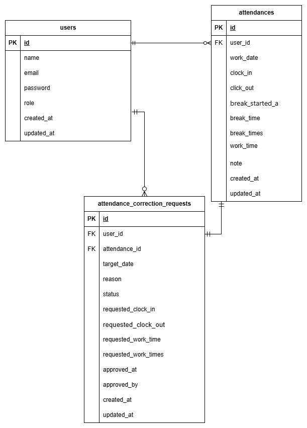

# 勤怠管理システム

## 概要

このプロジェクトは、従業員の出退勤管理と修正申請機能を提供する Web アプリケーションです。
Laravel フレームワークを使用して開発されています。

## 主な機能

- **ユーザー認証**

  - 管理者・一般ユーザーのログイン機能
  - 会員登録機能

- **出退勤管理**

  - 出勤・退勤の打刻機能
  - 休憩開始・終了の記録
  - 月次勤怠一覧の表示

- **勤怠修正申請**

  - 出退勤時間の修正申請
  - 休憩時間の修正申請
  - 申請状況の確認（承認待ち・承認済み）

- **管理者機能**
  - スタッフ一覧の表示
  - 個別スタッフの勤怠詳細表示・編集
  - 修正申請の承認・却下

## 技術スタック

- **フレームワーク**: Laravel
- **データベース**: MySQL
- **フロントエンド**: Blade Templates, CSS, JavaScript
- **認証**: Laravel Authentication

## セットアップ

### 必要な環境

- Docker & Docker Compose
- Make（オプション、Makefile を使用する場合）

### インストール手順

1. リポジトリをクローン

```bash
git clone <repository-url>
cd mockcase02
```

2. 初期設定（自動で環境構築・マイグレーション・シーダー実行）

```bash
make init
```

このコマンドで以下が自動実行されます：

- Docker コンテナのビルドと起動
- Composer 依存関係のインストール
- 環境設定ファイル（.env）の作成
- アプリケーションキーの生成
- データベースマイグレーション
- テストデータの投入

3. アプリケーションにアクセス

- ブラウザで `http://localhost` にアクセス

### その他の便利なコマンド

```bash
# コンテナの起動
make up

# コンテナの停止
make down

# コンテナの再起動
make restart

# ログの確認
make logs

# PHPコンテナにアクセス
make php-sh

# データベースをリフレッシュ（全データ削除→マイグレーション）
make fresh

# マイグレーションとシーダーの再実行
make seed

# コンテナの完全リフレッシュ
make refresh
```

## デフォルトアカウント

### 管理者

- **メールアドレス**: admin@example.com
- **パスワード**: password123

### 一般ユーザー

- **メールアドレス**: user1@example.com ～ user6@example.com
- **パスワード**: password123

## ディレクトリ構造

```
src/
├── app/
│   ├── Http/
│   │   ├── Controllers/     # コントローラー
│   │   └── Requests/        # フォームリクエスト
│   └── Models/              # モデル
├── database/
│   ├── migrations/          # マイグレーション
│   └── seeders/             # シーダー
├── resources/
│   ├── views/               # Bladeテンプレート
│   └── css/                 # CSSファイル
└── routes/
    └── web.php              # ルート定義
```

## ER 図



## テーブル仕様書

### users（ユーザー）

| カラム名   | 型              | 制約                        | 説明                     |
| ---------- | --------------- | --------------------------- | ------------------------ |
| id         | bigint unsigned | PRIMARY KEY, AUTO_INCREMENT | ユーザー ID              |
| name       | varchar(255)    | NULL 許可                   | ユーザー名               |
| email      | varchar(255)    | NOT NULL, UNIQUE            | メールアドレス           |
| password   | varchar(255)    | NOT NULL                    | パスワード（ハッシュ化） |
| role       | varchar(255)    | NOT NULL                    | ロール（admin/user）     |
| created_at | timestamp       | NULL 許可                   | 作成日時                 |
| updated_at | timestamp       | NULL 許可                   | 更新日時                 |

**インデックス**

- PRIMARY KEY: id
- UNIQUE: email

### attendances（勤怠）

| カラム名         | 型               | 制約                        | 説明                               |
| ---------------- | ---------------- | --------------------------- | ---------------------------------- |
| id               | bigint unsigned  | PRIMARY KEY, AUTO_INCREMENT | 勤怠 ID                            |
| user_id          | bigint unsigned  | NOT NULL, FOREIGN KEY       | ユーザー ID                        |
| work_date        | date             | NOT NULL                    | 勤務日                             |
| clock_in         | datetime         | NOT NULL                    | 出勤時刻                           |
| clock_out        | datetime         | NULL 許可                   | 退勤時刻                           |
| break_started_at | datetime         | NULL 許可                   | 休憩開始時刻（休憩中の一時保存用） |
| break_time       | unsigned integer | DEFAULT 0                   | 休憩時間（分）                     |
| break_times      | json             | NULL 許可                   | 個別休憩時間（JSON 配列）          |
| work_time        | unsigned integer | DEFAULT 0                   | 実働時間（分）                     |
| note             | text             | NULL 許可                   | 備考                               |
| created_at       | timestamp        | NULL 許可                   | 作成日時                           |
| updated_at       | timestamp        | NULL 許可                   | 更新日時                           |

**インデックス**

- PRIMARY KEY: id
- UNIQUE: (user_id, work_date)
- FOREIGN KEY: user_id → users.id (CASCADE DELETE)

**break_times JSON 形式**

```json
[
  {
    "start": "12:00",
    "end": "13:00"
  },
  {
    "start": "15:00",
    "end": "15:30"
  }
]
```

### attendance_correction_requests（修正申請）

| カラム名              | 型               | 制約                        | 説明                                    |
| --------------------- | ---------------- | --------------------------- | --------------------------------------- |
| id                    | bigint unsigned  | PRIMARY KEY, AUTO_INCREMENT | 申請 ID                                 |
| user_id               | bigint unsigned  | NOT NULL, FOREIGN KEY       | ユーザー ID                             |
| attendance_id         | bigint unsigned  | NULL 許可, FOREIGN KEY      | 勤怠 ID（実績がない場合は NULL）        |
| target_date           | date             | NOT NULL                    | 対象日                                  |
| reason                | text             | NOT NULL                    | 申請理由（備考）                        |
| status                | enum             | DEFAULT 'pending'           | ステータス（pending/approved/rejected） |
| requested_clock_in    | datetime         | NULL 許可                   | 申請出勤時刻                            |
| requested_clock_out   | datetime         | NULL 許可                   | 申請退勤時刻                            |
| requested_break_time  | unsigned integer | NULL 許可                   | 申請休憩時間（分）                      |
| requested_break_times | json             | NULL 許可                   | 申請個別休憩時間（JSON 配列）           |
| requested_work_time   | unsigned integer | NULL 許可                   | 申請実働時間（分）                      |
| approved_at           | timestamp        | NULL 許可                   | 承認日時                                |
| approved_by           | bigint unsigned  | NULL 許可, FOREIGN KEY      | 承認者 ID                               |
| created_at            | timestamp        | NULL 許可                   | 作成日時                                |
| updated_at            | timestamp        | NULL 許可                   | 更新日時                                |

**インデックス**

- PRIMARY KEY: id
- FOREIGN KEY: user_id → users.id (CASCADE DELETE)
- FOREIGN KEY: attendance_id → attendances.id (CASCADE DELETE, NULL 許可)
- FOREIGN KEY: approved_by → users.id

**requested_break_times JSON 形式**

```json
[
  {
    "start": "12:00",
    "end": "13:00"
  },
  {
    "start": "15:00",
    "end": "15:30"
  }
]
```

## 主要なルート

### ユーザー側

- `GET /login` - ログイン画面
- `POST /login` - ログイン処理
- `GET /register` - 会員登録画面
- `POST /register` - 会員登録処理
- `GET /attendance` - 出退勤打刻画面
- `GET /attendance/index` - 勤怠一覧
- `GET /attendance/show/{id}` - 勤怠詳細
- `GET /attendance/request` - 修正申請一覧
- `POST /stamp_correction_request` - 修正申請送信

### 管理者側

- `GET /admin/login` - 管理者ログイン画面
- `POST /admin/login` - 管理者ログイン処理
- `GET /admin/attendance/list` - 退勤一覧
- `GET /admin/staff/list` - スタッフ一覧
- `GET /admin/staff/{id}` - スタッフ勤怠詳細
- `POST /admin/staff/{id}` - スタッフ勤怠更新
- `GET /admin/attendance/request` - 修正申請一覧
- `GET /stamp_correction_request/approve/{id}` - 修正申請承認画面
- `POST /stamp_correction_request/approve/{id}` - 修正申請承認処理

## バリデーション

### 会員登録

- お名前: 必須
- メールアドレス: 必須、メール形式、ユニーク
- パスワード: 必須、8 文字以上
- パスワード確認: パスワードと一致

### 修正申請

- 対象日: 必須、日付形式
- 出勤時間: 時刻形式（H:i）
- 退勤時間: 時刻形式（H:i）
- 休憩開始時間: 時刻形式（H:i）
- 休憩終了時間: 時刻形式（H:i）
- 備考: 必須、最大 1000 文字

## 開発

### Docker コンテナ内でコマンドを実行

```bash
# PHPコンテナにアクセス
make php-sh

# コンテナ内で実行する例
php artisan migrate
php artisan db:seed
php artisan cache:clear
php artisan config:clear
php artisan view:clear
```

または、直接コマンドを実行：

```bash
# マイグレーション実行
docker compose exec php php artisan migrate

# シーダー実行
docker compose exec php php artisan db:seed

# キャッシュクリア
docker compose exec php php artisan cache:clear
docker compose exec php php artisan config:clear
docker compose exec php php artisan view:clear
```

### Makefile コマンド一覧

| コマンド       | 説明                                                                 |
| -------------- | -------------------------------------------------------------------- |
| `make init`    | 初期設定（ビルド、依存関係インストール、マイグレーション、シーダー） |
| `make buildup` | コンテナのビルドと起動                                               |
| `make up`      | コンテナの起動                                                       |
| `make down`    | コンテナの停止                                                       |
| `make restart` | コンテナの再起動                                                     |
| `make fresh`   | データベースをリフレッシュ（全削除 → マイグレーション）              |
| `make seed`    | マイグレーションとシーダーの実行                                     |
| `make logs`    | ログの確認                                                           |
| `make php-sh`  | PHP コンテナにアクセス                                               |
| `make refresh` | コンテナの完全リフレッシュ                                           |

## ライセンス

このプロジェクトは MIT ライセンスの下で公開されています。
